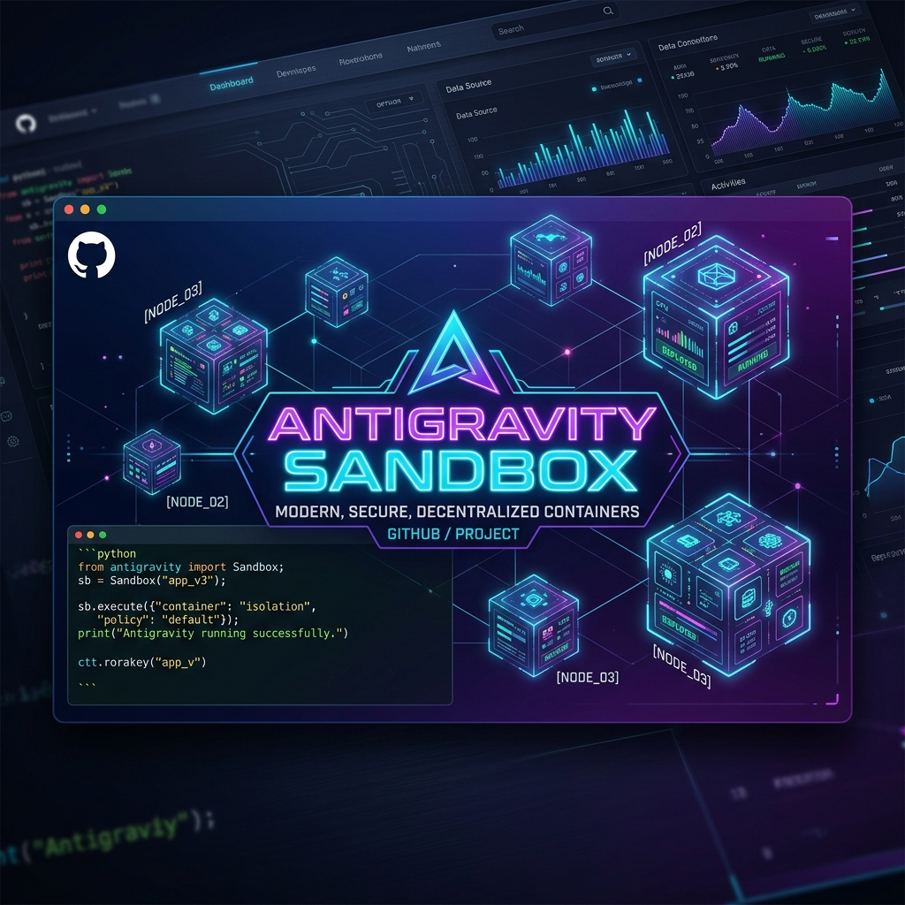

# ⚡ Antigravity Sandbox — Remote Code Execution Engine



A lightweight, high-performance, and secure remote code execution service. It evaluates untrusted user code (Python & JavaScript) inside ephemeral, resource-constrained, and non-root Docker sandboxes, leveraging Redis to cache identical executions for sub-millisecond response latency.

This repository includes a TypeScript API, isolated sandboxed environments, an automated lifecycle controller, and an interactive modern dark-mode console playground.

---

## 🛠️ System Architecture

The workflow of a user submission is shown below:

```mermaid
graph TD
    Client[Web Client / Curl] -->|POST /execute| API[TypeScript Express API]
    API -->|1. Generate Cache Key| Hash[SHA-256 Hash of Code]
    Hash -->|2. Check Cache| Redis{Redis Cache}
    Redis -->|Hit (Return Saved Output)| Client
    Redis -->|Miss| Engine[Sandbox Dispatcher]
    Engine -->|3. Write script to temp file| SandboxDir[/tmp/sandbox/sandbox_*.js | .py]
    Engine -->|4. Invoke Docker run with resource limits| Docker[Docker Runner Sandbox]
    Docker -->|5. Run code as 'runner' user| Exec[NodeJS / Python Executed]
    Exec -->|6. Retrieve Stdout/Stderr/ExitCode| Engine
    Engine -->|7. Cleanup temp file| SandboxDir
    Engine -->|8. Cache result in Redis| Redis
    Engine -->|9. Send response| Client
```

### Sandbox Protections & Constraints:
* **User Isolation:** Executed entirely under the non-root `runner` user.
* **CPU Limit:** Capped at `0.5` CPU cores (`--cpus=0.5`).
* **Memory Limit:** Capped at `256MB` RAM (`--memory=256m`).
* **Storage Protection:** The `/tmp/sandbox` directory containing the executing script is mounted **read-only** (`:ro`), blocking any attempts to rewrite or corrupt workspace files.
* **Execution Timeout:** Enforced server-side execution limit of `10 seconds`.

---

## 🚀 Quickstart Guide

The entire development and deployment lifecycle is automated using the `./manage.sh` control script.

### 1. Prerequisites Setup
Verify system dependencies (Docker & Git) and pull the latest base images (`python:3.12-slim` and `node:20-alpine`):
```bash
./manage.sh setup
```

### 2. Build Services
Build the container images tagged with the short Git commit SHA for deployment tracking:
```bash
./manage.sh build
```

### 3. Run and Validate the System
Spin up the Redis database and the Express service stack, wait for readiness, and execute automatic integration tests (Python & JS payloads):
```bash
./manage.sh test
```

Once running, you can access the interactive Web Playground at **[http://localhost:3000](http://localhost:3000)**!

### 4. Monitor Sandbox Logs
Tail execution logs with automated highlight coloring for `ERROR` and `CRITICAL` entries:
```bash
./manage.sh logs
```

### 5. Deep Clean Up
Tear down the composition volumes, remove active containers, and delete all temporary script files generated in `/tmp/sandbox`:
```bash
./manage.sh clean
```

---

## 📂 Repository Structure

* **`containers/`**
  * `api/` — Container definition for the main TypeScript API hosting node.js and docker-cli.
  * `python/` — Sandbox Python execution environment running as non-root user `runner`.
  * `nodejs/` — Sandbox Node.js execution environment running as non-root user `runner`.
* **`src/`**
  * `index.ts` — Main Express server implementing compilation logic, filesystem mounting, execution spawning, and Redis middleware.
* **`public/`**
  * Glassmorphic, dark-mode terminal/editor playground for interactive sandbox testing.
* **`manage.sh`**
  * Unified command automation CLI.
